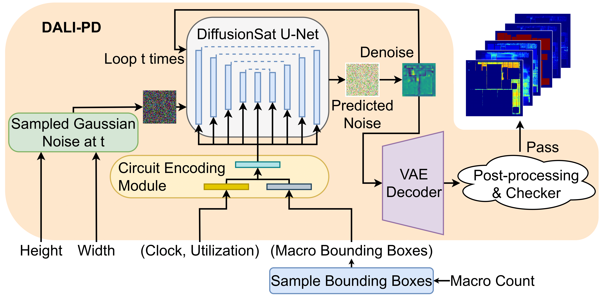

****

**Authors**

**B.-Y. Wu** and V. A. Chhabria

**Abstract**

  

Machine learning (ML) has demonstrated significant promise in various physical design (PD) tasks. However, model generalizability remains limited by the availability of high-quality, large-scale training datasets. Creating such datasets is often computationally expensive and constrained by IP. While very few public datasets are available, they are typically static, slow to generate, and require frequent updates. To address these limitations, we present DALI-PD, a scalable framework for generating synthetic layout heatmaps to accelerate ML in PD research. DALI-PD uses a diffusion model to generate diverse layout heatmaps via fast inference in seconds. The heatmaps include power, IR drop, congestion, macro placement, and cell density maps. Using DALI-PD, we created a dataset comprising over 20,000 layout configurations with varying macro counts and placements. These heatmaps closely resemble real layouts and improve ML accuracy on downstream ML tasks such as IR drop or congestion prediction.

<a href="https://arxiv.org/pdf/2507.10606" style="text-decoration: none;">Download Paper</a>