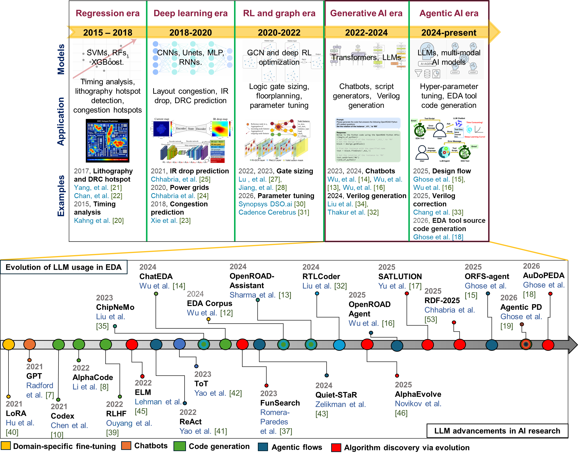

****

**Authors**

**B.-Y. Wu**, A. Dey, A. Rovinski, and V. A. Chhabria

**Abstract**

  

Physical design remains one of the most complex stages of chip implementation, requiring deep expertise in electronic design automation (EDA) tools, workflows, and design knowledge. While open-source EDA tools have improved accessibility and reproducibility, the effective use of physical design flows still requires significant manual effort and domain expertise. In parallel, large language models (LLMs) have rapidly evolved from data-driven language models to assistants and tool-interacting agents capable of reasoning, code generation, and closed-loop execution. This paper presents a perspective on the evolution of LLM usage in physical design, tracing a progression from early data-driven question answering and script generation to tool-aware assistants and closed-loop agentic workflows for physical design tasks. This paper highlights this evolution using representative open-source efforts and case studies. Further, we outline emerging research directions in which agentic LLMs move  toward optimization and algorithm discovery, including the automation of tasks such as engineering change orders (ECOs) and the exploration of algorithm discovery within physical design tools. The work also highlights opportunities and challenges of LLM-driven design automation.
