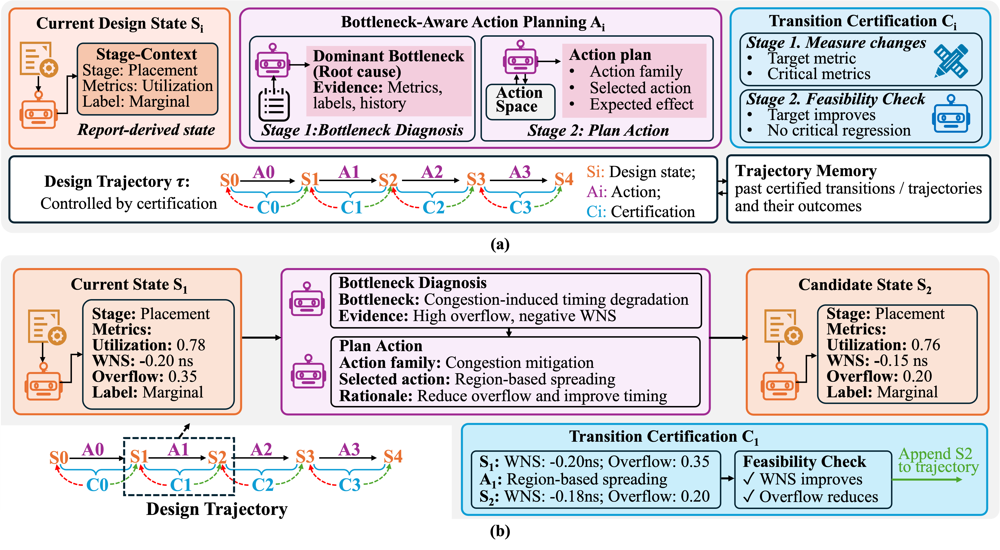

****

**Authors**

Z. Jiang, Q. Wu, **B.-Y. Wu**, and J. Zhang'

**Abstract**

  

VLSI Physical design is a long, stage-coupled flow with multiple tunable parameters. Efficient optimization is challenging because each evaluation is expensive, and decisions made in one stage can strongly affect final metric such as power, performance, and area (PPA). Traditional design space exploration (DSE) methods, such as Bayesian optimization, rely on repeated full-flow evaluations guided by mathematical surrogate models. Although effective in some settings, these methods can be costly and may waste iterations on failed or low-quality configurations. Recent advances in large language model (LLM) agents provide a new opportunity for physical design tasks. However, existing approaches often make coarse-grained global decisions over the entire flow. Since physical design is a long-horizon and highly stage-coupled task, such global decision making may fail to fully exploit the reasoning capability of LLMs or identify the stage-specific bottlenecks that dominate final auality of results (QoR). Hence, these methods can still struggle to achieve optimal solutions. In this work, we present CAPO, a certification-guided agentic workflow for physical design parameter optimization. CAPO improves decision makeing through structured state abstraction, bottleneck-aware planning, and transition certification. By maintaining a compact representation of flow state and certifying candidate acinterventions before execution, CAPO avoids downstream-harmful or unrecoverable actions while supporting both optimization and recovery in a unified loop. Across standard benchmarks, CAPO consistently outperforms state-of-the-art baselines, reducing total negative slack and power consumption by up to 61.0% and 3.5%, respectively, while improving overall flow stability.

