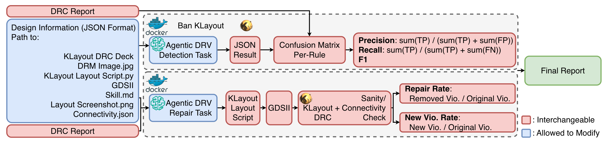

****

**Authors**

**B.-Y. Wu**, C.-T. Ho, H. Yang, C.-C. Chang, A. B. Akkur, B. Khailany, and V. A. Chhabria

**Abstract**

  

As technology nodes scale, design rule checks (DRC) have become increasingly complex and context-dependent, making design rule violation (DRV) repair a major bottleneck in digital VLSI design closure. Today, DRC debugging remains largely manual, requiring iterative analysis of rule reports and layout context under tight tapeout schedules. Recent advances in large language models (LLMs), particularly agentic systems capable of tool interaction and iterative reasoning, offer a promising direction to automate DRC workflows. We introduce a multimodal benchmark suite for agentic DRC tasks, covering both DRV detection and DRV repair. The benchmark spans multiple design scales, from polygon-level patterns to block-level layouts, and is built on an extended ASAP7 technology with increased rule complexity. We further develop evaluation infrastructure with containerized execution and standardized metrics. Initial results show that while LLM-based agents perform well on small, structured cases, they struggle to scale to larger designs with complex rule interactions. This benchmark provides a foundation for developing agentic DRC solutions.

