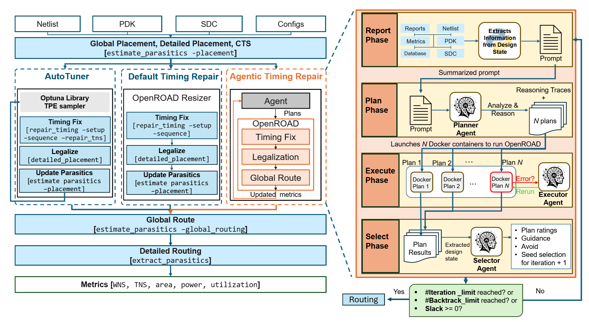

****

**Authors**

V. A. Chhabria, A, Dey, A. B. Kahng, I. Savidis, P. Shrestha, and **B.-Y. Wu**

**Abstract**

  

Timing optimization in modern electronic design automation (EDA) tools requires strategies that effectively control heuristic engines and tool-specific input knobs. In OpenROAD, Resizer exposes timing repair operations and knobs, but selecting the right action depends on timing state, physical context, optimization history, and quality-of-results (QoR) metrics such as worst negative slack (WNS), total negative slack (TNS), area, power, and runtime. Prior autotuning methods search predefined knob spaces, but remain limited by the user-specified search space. We propose ResizerAgent, which uses large language model (LLM) reasoning to adaptively revise repair strategies, backtrack from regressions, and generate targeted fixes. An LLM-based planner-selector controller observes timing reports, design metrics, physical feedback, and prior outcomes to propose, evaluate, and refine repair strategies across iterations. By combining multi-plan exploration, physical awareness, and traceable reasoning, ResizerAgent enables strategy-level timing optimization. Experimental results show that ResizerAgent improves the effective clock period over an autotuned baseline with a comparable compute budget, while the planner-selector traces provide actionable insight into each repair decision that conventional autotuners do not offer.

